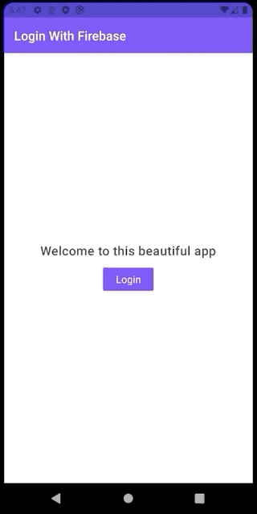

# LoginWithFirebase
A app to show how to use Firebase Authentication library to add multiple sign in options easily. The app uses [Firebase Auth-UI library](https://firebase.google.com/docs/auth/android/firebaseui?authuser=0) to provide multiple sign in options.

 